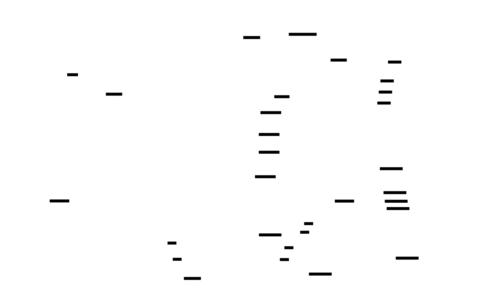
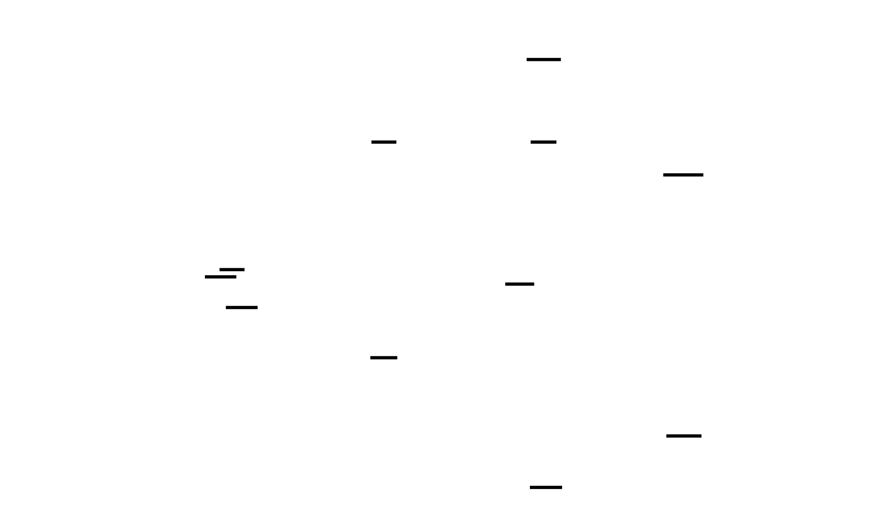

# Architecture

This document describes the technical architecture of the BujoPdf planner generator.

## Overview

BujoPdf uses a component-based architecture built on top of the [Prawn PDF library](https://github.com/prawnpdf/prawn). The system is organized into seven main layers:

1. **DSL** - Declarative planner definition with configuration and runtime support
2. **PDFs (Recipes)** - Complete planner recipe definitions
3. **Pages** - Individual page types (seasonal calendar, weekly pages, etc.)
4. **Layouts** - Declarative layout system with automatic sidebar management
5. **Components** - Reusable UI elements with verb-based API
6. **Themes** - Color scheme definitions (light, earth, dark)
7. **Utilities** - Core helpers (grid system, date calculations, dot grids)



## Core Concepts

### Grid-Based Layout System

All positioning uses a **grid coordinate system** rather than raw PDF points:

- **Grid dimensions**: 43 columns × 55 rows
- **Box size**: 14.17pt (≈5mm) matching dot spacing
- **Page size**: 612pt × 792pt (US Letter)

**Coordinate conversion methods:**
- `grid_x(col)` - Convert column to x-coordinate
- `grid_y(row)` - Convert row to y-coordinate (row 0 = top)
- `grid_width(boxes)` - Convert box count to width
- `grid_height(boxes)` - Convert box count to height
- `grid_rect(col, row, w, h)` - Get bounding box coordinates

This abstraction ensures all elements align perfectly with the dot grid background.



### Declarative Layout System

Pages declare their layout intent rather than implementing layout details:

```ruby
class MyPage < Pages::Base
  def setup
    use_layout :standard_with_sidebars,
      current_week: @week_num,
      highlight_tab: :year_events,
      year: @year,
      total_weeks: @total_weeks
  end
end
```

**Available layouts:**
- `:full_page` - No sidebars, full 43×55 content area
- `:standard_with_sidebars` - Left week sidebar (3 cols) + right nav tabs (1 col)

Layouts automatically:
- Render navigation sidebars
- Calculate content area boundaries
- Handle highlighting (current week, current tab)

**Benefits:**
- Single source of truth for sidebar behavior
- Changes to sidebars require editing only the layout class
- Pages focus on content, not chrome


### Component Verb System

Components provide **verb methods** that pages can call directly for common rendering tasks. This creates a clean, declarative API where pages describe what to render rather than how.

**Architecture:**
- Each component defines a `Mixin` module with its verb method(s)
- `Components::All` aggregates all mixins
- `Pages::Base` includes `Components::All`, giving all pages access to verbs

**Available verbs:**
```ruby
# Content components
h1(col, row, content, **opts)           # Large heading
h2(col, row, content, **opts)           # Medium heading
text(col, row, content, **opts)         # Text at grid position
ruled_lines(col, row, w, h, **opts)     # Horizontal ruled lines
ruled_list(col, row, w, h, **opts)      # Numbered/bulleted list
mini_month(col, row, year, month)       # Compact month calendar
fieldset(position:, legend:, **opts)    # Bordered section with legend

# Drawing components
box(col, row, w, h, **opts)             # Rectangle outline/fill
hline(col, row, width, **opts)          # Horizontal line
vline(col, row, height, **opts)         # Vertical line
grid_dots(col, row, w, h, **opts)       # Dot grid overlay
erase_dots(col, row, w, h)              # White rectangle to hide dots
```

**Usage in pages:**
```ruby
class MyPage < Pages::Base
  def render
    h1(5, 2, "Title")
    ruled_lines(5, 5, 30, 20)
    fieldset(position: :top_left, legend: "Notes")
  end
end
```

**Navigation components** (used by layouts, not verbs):
- **WeekSidebar** - Vertical week list with month indicators
- **RightSidebar** - Rotated tabs for year/grid pages
- **TopNavigation** - Previous/next week buttons


## Key Classes


### DSL Classes (`lib/bujo_pdf/dsl/`)

**Builder** (`builder.rb`)
- Entry point for defining planners
- Creates Context and manages PDF generation lifecycle
- Loads configuration (dates, calendars, collections)

**Context** (`context.rb`)
- Runtime state container (pdf, year, theme, grid_system)
- Provides component instantiation methods
- Manages current page state during rendering

**PageRegistry** (`registry.rb`)
- Tracks all pages and their named destinations
- Supports page grouping for outline generation
- Enables `outline: true` flag for automatic bookmark inclusion

**Configuration** (`dsl/configuration/`)
- `Dates` - Load dates.yml for special dates
- `Calendars` - Load calendars.yml and fetch iCal events
- `Collections` - Load collections.yml for custom collection pages

**Runtime** (`dsl/runtime/`)
- `PageFactory` - Create page instances with dependency injection
- `RenderContext` - Immutable context passed to renderers
- `ComponentContext` - Context for component instantiation

### PDFs (Recipes) (`lib/bujo_pdf/pdfs/`)

**StandardPlanner** (`standard_planner.rb`)
- Complete planner recipe defining all pages
- Page ordering and grouping for outline
- Configuration of index pages, future log, reviews, etc.

### DateCalculator (`lib/bujo_pdf/utilities/date_calculator.rb`)

**Responsibility**: All date/week calculations for the planner

**Week numbering system:**
- Week 1 starts on the Monday on or before January 1
- Weeks increment sequentially through the year
- Total weeks: typically 52-53 depending on year

**Key methods:**
- `year_start_monday(year)` - First Monday of the year's week 1
- `total_weeks(year)` - Total weeks in the year
- `week_number_for_date(date, year)` - Get week number for any date
- `week_start(year, week)` / `week_end(year, week)` - Week boundaries
- `season_for_month(month)` - Determine season

### GridSystem (`lib/bujo_pdf/utilities/grid_system.rb`)

**Responsibility**: Convert grid coordinates to PDF points

Core module mixed into all page and component classes. See "Grid-Based Layout System" above for details.

### DotGrid (`lib/bujo_pdf/utilities/dot_grid.rb`)

**Responsibility**: Draw dot grid backgrounds

Uses Prawn stamps for efficiency:
```ruby
DotGrid.create_stamp(pdf, "page_dots")  # Create once
pdf.stamp("page_dots")                   # Reuse everywhere
```

Draws dots at every grid intersection (43×55 = 2,365 dots per page).

## Page Types

### Front Matter Pages

**Index Pages** (`index_pages.rb`)
- Numbered blank pages for hand-built table of contents
- Ruled entry lines with page number boxes
- Named destinations: `index_1`, `index_2`, etc.

**Future Log** (`future_log.rb`)
- 6-month spread for events beyond current planning horizon
- 3 months per page (2 pages default)
- Named destinations: `future_log_1`, `future_log_2`

**Collection Pages** (`collection_page.rb`)
- User-configured titled pages for custom collections
- Examples: "Books to Read", "Project Ideas"
- Configured via `config/collections.yml`
- Named destinations: `collection_<id>`

**Monthly Review** (`monthly_review.rb`)
- Prompt-based templates for monthly reflection
- Three sections: What Worked, What Didn't, Focus for Next Month
- One page per month (12 pages total)
- Named destinations: `review_1` through `review_12`

**Quarterly Planning** (`quarterly_planning.rb`)
- 12-week planning cycles inspired by "12 Week Year"
- Goals section with numbered prompts
- 12-week grid with links to weekly pages
- Named destinations: `quarter_1` through `quarter_4`

### Year Overview Pages

**Seasonal Calendar** (`seasonal_calendar.rb`)
- Four seasons in quadrants with fieldset borders
- Mini month calendars with clickable dates
- Each date links to its corresponding weekly page

**Year-at-a-Glance** (`year_events.rb`, `year_highlights.rb`)
- 12 columns (months) x 31 rows (days)
- Day numbers with day-of-week abbreviations
- Each cell links to corresponding weekly page

**Multi-Year Overview** (`multi_year_overview.rb`)
- Spans multiple years with monthly groupings
- Provides context beyond the current year

**Tracker Example** (`tracker_example.rb`)
- "Show, don't prescribe" example of grid usage
- Habit tracker with 31-day grid
- Mood/energy log examples

### Weekly Pages (`weekly_page.rb`)

- **Daily section** (17.5%): 7 columns for Mon-Sun
- **Cornell notes section** (82.5%):
  - Cues column (25%)
  - Notes column (75%)
  - Summary area (20%)
- Navigation: previous/next week, back to year overview
- Time period labels (AM/PM/EVE)

### Grid Template Pages (`pages/grids/`)

**Grid Showcase** (`grid_showcase.rb`)
- All grid types in quadrants (entry point)

**Grids Overview** (`grids_overview.rb`)
- Clickable samples of basic grids

**Individual Grid Pages:**
- `dot_grid_page.rb` - Full-page 5mm dot grid
- `graph_grid_page.rb` - Full-page 5mm square grid
- `lined_grid_page.rb` - Full-page 10mm ruled lines
- `isometric_grid_page.rb` - 30-60-90 degree diamond grid
- `perspective_grid_page.rb` - 1-point perspective with guides
- `hexagon_grid_page.rb` - Tessellating flat-top hexagons

### Wheel Pages

**Daily Wheel** (`daily_wheel.rb`)
- Circular daily planning template

**Year Wheel** (`year_wheel.rb`)
- Circular year-at-a-glance visualization

### Reference Page (`reference_calibration.rb`)

- Grid calibration with measurements
- Centimeter markings along edges
- Coordinate system reference

## Navigation System

### Named Destinations

PDF named destinations enable hyperlink navigation:

- `seasonal` - Seasonal calendar page
- `year_events` - Year at a Glance - Events
- `year_highlights` - Year at a Glance - Highlights
- `multi_year_overview` - Multi-year overview page
- `week_N` - Weekly page N (e.g., `week_1`, `week_42`)
- `reference` - Grid reference/calibration page
- `dots` - Blank dot grid page

### Link Annotations

Clickable regions use Prawn's `link_annotation` method:

```ruby
@pdf.link_annotation([left, bottom, right, top],
                    Dest: "week_#{week_num}",
                    Border: [0, 0, 0])
```

Coordinates use `[left, bottom, right, top]` format, all measured from page bottom.

The `grid_link` helper simplifies this:

```ruby
grid_link(col, row, width_boxes, height_boxes, "week_1")
```

## File Organization

```
lib/bujo_pdf/
├── constants.rb               # Layout constants
│
├── dsl/                       # DSL for planner definition
│   ├── builder.rb             # Entry point for planners
│   ├── context.rb             # Runtime state container
│   ├── registry.rb            # Page registration and destinations
│   ├── definition.rb          # Base planner definition
│   ├── metadata.rb            # PDF metadata
│   ├── outline.rb             # PDF outline/bookmarks
│   ├── page_declaration.rb    # Page declaration helpers
│   ├── week.rb                # Week-related DSL methods
│   ├── inline_page.rb         # Inline page definitions
│   ├── configuration/         # Config file loaders
│   │   ├── dates.rb           # dates.yml loader
│   │   ├── collections.rb     # collections.yml loader
│   │   ├── calendars.rb       # calendars.yml loader
│   │   └── calendars/         # iCal integration
│   │       ├── config_loader.rb
│   │       ├── event.rb
│   │       ├── event_store.rb
│   │       ├── ical_fetcher.rb
│   │       ├── ical_parser.rb
│   │       └── recurring_event_expander.rb
│   └── runtime/               # Execution-time support
│       ├── component_context.rb
│       ├── page_factory.rb
│       ├── page_ref.rb
│       ├── page_set.rb
│       ├── page_set_context.rb
│       └── render_context.rb
│
├── pdfs/                      # Planner recipes
│   └── standard_planner.rb    # Standard planner recipe
│
├── base/                      # User extension points
│   ├── component.rb           # Base component class
│   └── layout.rb              # Base layout class
│
├── pages/                     # Page implementations
│   ├── base.rb
│   ├── all.rb                 # Page class aggregator
│   ├── seasonal_calendar.rb
│   ├── year_events.rb
│   ├── year_highlights.rb
│   ├── multi_year_overview.rb
│   ├── weekly_page.rb
│   ├── index_pages.rb
│   ├── future_log.rb
│   ├── collection_page.rb
│   ├── monthly_review.rb
│   ├── quarterly_planning.rb
│   ├── tracker_example.rb
│   ├── grid_showcase.rb
│   ├── grids_overview.rb
│   ├── daily_wheel.rb
│   ├── year_wheel.rb
│   ├── reference_calibration.rb
│   └── grids/                 # Grid template pages
│       ├── dot_grid_page.rb
│       ├── graph_grid_page.rb
│       ├── lined_grid_page.rb
│       ├── isometric_grid_page.rb
│       ├── perspective_grid_page.rb
│       └── hexagon_grid_page.rb
│
├── layouts/                   # Layout system
│   ├── base_layout.rb
│   ├── full_page_layout.rb
│   ├── standard_with_sidebars_layout.rb
│   └── layout_factory.rb
│
├── components/                # Reusable UI components (verb pattern)
│   ├── all.rb                 # Mixin aggregator
│   ├── sub_component_base.rb  # Base for sub-components
│   │                          # Navigation (used by layouts)
│   ├── week_sidebar.rb
│   ├── right_sidebar.rb
│   ├── top_navigation.rb
│   │                          # Content verbs
│   ├── text.rb
│   ├── h1.rb
│   ├── h2.rb
│   ├── fieldset.rb
│   ├── ruled_lines.rb
│   ├── ruled_list.rb
│   ├── mini_month.rb
│   │                          # Drawing verbs
│   ├── box.rb
│   ├── hline.rb
│   ├── vline.rb
│   ├── grid_dots.rb
│   ├── erase_dots.rb
│   │                          # Specialized
│   ├── cornell_notes.rb
│   ├── daily_section.rb
│   ├── day_header.rb
│   ├── week_column.rb
│   ├── week_grid.rb
│   ├── grid_ruler.rb
│   ├── todo_list.rb
│   └── layout_helpers.rb
│
├── themes/                    # Color themes
│   ├── theme_registry.rb
│   ├── light.rb
│   ├── earth.rb
│   └── dark.rb
│
└── utilities/                 # Core helpers
    ├── grid_system.rb
    ├── date_calculator.rb
    └── grid_renderers/        # Specialized grid renderers
```

## Design Principles

### Single Responsibility

Each class has one clear purpose:
- Pages generate content
- Layouts manage chrome
- Components render reusable UI
- Utilities provide calculations

### Declarative Over Imperative

Pages declare "what" they want (layout type, navigation state) rather than "how" to render it.

### Grid-Based Positioning

All coordinates use the grid system, ensuring perfect alignment with dot backgrounds.

### Immutable Context

`RenderContext` is immutable, preventing state bugs during rendering.

### Dependency Injection

`PageFactory` injects dependencies (PDF, context, utilities) rather than pages creating them.

## Testing Strategy

### Unit Tests (`test/unit/`)

Fast tests (<1 second) for utilities and components:
- **GridSystem**: Coordinate conversion, helpers
- **DateCalculator**: Week numbering, boundaries, edge cases
- **DotGrid**: Position calculations
- **RenderContext**: Initialization, query methods

### Integration Tests (`test/integration/`)

Slower tests (~30 seconds) for full PDF generation:
- Successful generation without errors
- PDF file size validation
- Multi-year generation
- Leap year handling
- Performance benchmarks

### Coverage

- **Overall**: 84%+ coverage
- **Per-file minimum**: 15% (presentation layer harder to test)
- **SimpleCov** reports in `coverage/` directory

## Performance Optimizations

### Dot Grid Stamps

Instead of drawing 2,365 dots per page (43×55 grid), create a stamp once and reuse:

```ruby
DotGrid.create_stamp(@pdf, "page_dots")  # ~90% smaller file size
```

### Efficient Link Annotations

Links use absolute coordinates calculated once, no repeated conversions.

### Minimal Font Embedding

Uses PDF built-in fonts (Helvetica) to reduce file size.

## Themes System

The themes system provides color scheme definitions:

```ruby
# lib/bujo_pdf/themes/
├── theme_registry.rb  # Registry for theme lookup
├── light.rb           # Light theme (default)
├── earth.rb           # Earth-toned theme
└── dark.rb            # Dark theme
```

**Theme structure:**
```ruby
module BujoPdf::Themes
  class Light
    DOT_COLOR = 'CCCCCC'
    BORDER_COLOR = 'E5E5E5'
    TEXT_COLOR = '333333'
    WEEKEND_BG = 'FAFAFA'
    # ...
  end
end
```

**Usage:**
```ruby
BujoPdf::DSL::Builder.build(year: 2025, theme: :earth) do
  # planner definition
end
```

## Extension Points

### Adding New Page Types

1. Create page class in `lib/bujo_pdf/pages/`
2. Inherit from `Pages::Base`
3. Implement `render` method using component verbs
4. Add to planner recipe in `lib/bujo_pdf/pdfs/`
5. Register named destination in DSL definition

### Creating New Layouts

1. Create layout class in `lib/bujo_pdf/layouts/`
2. Inherit from `BaseLayout` (or `Base::Layout`)
3. Implement `calculate_content_area` and `render_chrome` methods
4. Register symbol in `LayoutFactory`

### Adding Components (Verb Pattern)

1. Create component class in `lib/bujo_pdf/components/`
2. Define a `Mixin` module with verb method(s)
3. Implement `render` method in the main class
4. Add mixin to `Components::All`
5. Verb becomes available to all pages

```ruby
# Example: Adding a new component
module BujoPdf::Components
  class MyComponent
    module Mixin
      def my_verb(col, row, **opts)
        MyComponent.new(pdf: @pdf, grid: @grid_system, **opts).render
      end
    end

    def initialize(pdf:, grid:, **opts)
      @pdf = pdf
      @grid = grid
    end

    def render
      # drawing operations
    end
  end
end

# In components/all.rb:
base.include MyComponent::Mixin
```

### Creating Custom Themes

1. Create theme class in `lib/bujo_pdf/themes/`
2. Define color constants matching existing themes
3. Register in `ThemeRegistry`

## Debug Mode

Toggle `DEBUG_GRID` in `planner_generator.rb`:

```ruby
DEBUG_GRID = true  # Show diagnostic grid overlay
```

Adds:
- Red dots at grid intersections
- Dashed red lines every 5 boxes
- Coordinate labels `(col, row)`

Useful for verifying layout calculations.

## Further Reading

- **CLAUDE.md** - Detailed technical documentation for Claude Code
- **COMPONENTS.md** - Component design patterns
- **GRID_HELPERS.md** - Grid system helper methods
- **PRAWN_CHEAT_SHEET.md** - Prawn PDF library reference
- **REFACTORING_PLAN.md** - Future architectural improvements
