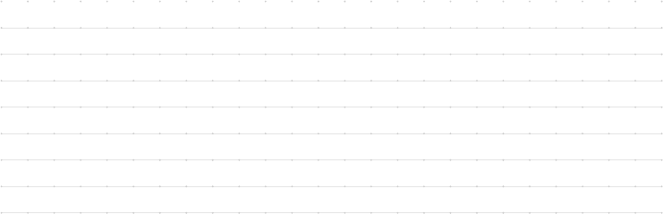
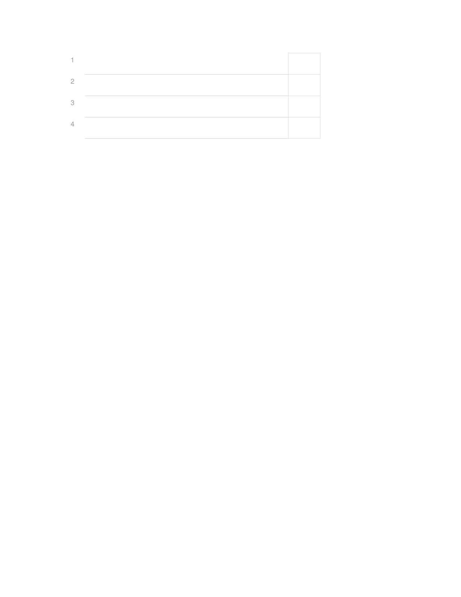
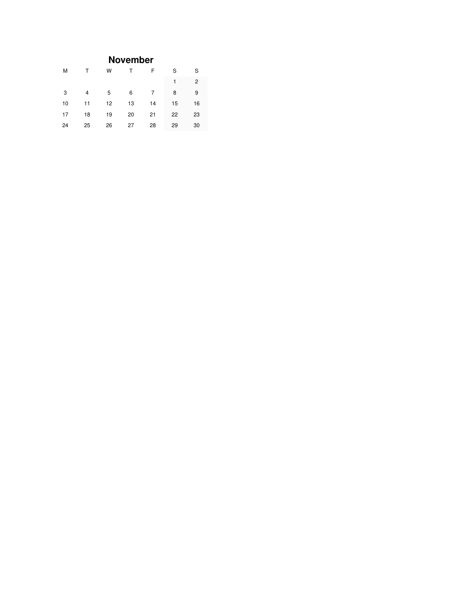
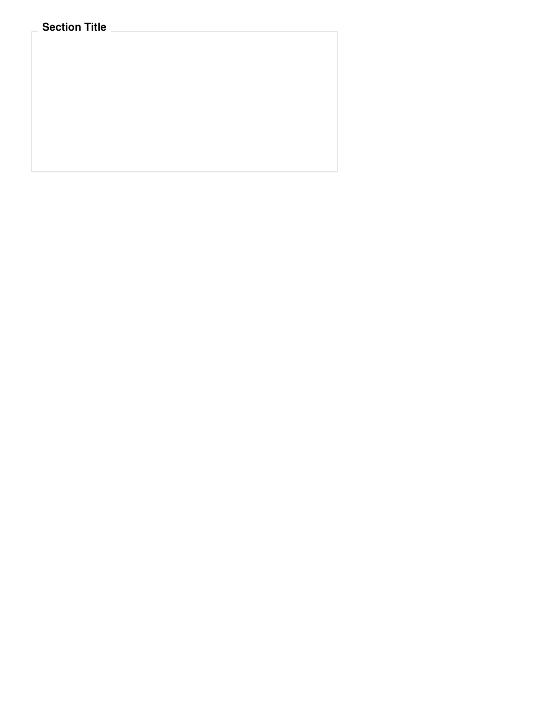
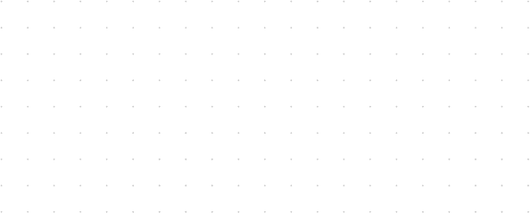

# Component Documentation

This document describes the component architecture in the BujoPdf planner generator.

## Component Verb Pattern

Components in BujoPdf use a **verb pattern** where pages call methods directly rather than instantiating component classes. This creates a declarative, readable API.

### Architecture

```ruby
# Each component defines a Mixin module
module BujoPdf::Components
  class H1
    module Mixin
      def h1(col, row, text, **opts)
        H1.new(pdf: @pdf, grid: @grid_system, col: col, row: row, text: text, **opts).render
      end
    end

    def initialize(pdf:, grid:, col:, row:, text:, **opts)
      @pdf = pdf
      @grid = grid
      @col = col
      @row = row
      @text = text
      @opts = opts
    end

    def render
      # Drawing operations
    end
  end
end
```

### Component Aggregation

`Components::All` aggregates all component mixins:

```ruby
module Components::All
  def self.included(base)
    base.include GridDots::Mixin
    base.include RuledLines::Mixin
    base.include Text::Mixin
    base.include H1::Mixin
    base.include H2::Mixin
    base.include Box::Mixin
    base.include HLine::Mixin
    base.include VLine::Mixin
    base.include Fieldset::Mixin
    base.include MiniMonth::Mixin
    base.include RuledList::Mixin
    # ...
  end
end
```

`Pages::Base` includes `Components::All`, giving all pages access to verbs.

---

## Content Verbs

### `h1(col, row, text, **opts)`
Large heading text.

> 

**Location**: `lib/bujo_pdf/components/h1.rb`

**Options:**
- `width:` - Width in grid boxes (default: auto)
- `align:` - Text alignment `:left`, `:center`, `:right`
- `color:` - Text color (hex string)

### `h2(col, row, text, **opts)`
Medium heading text.

> 

**Location**: `lib/bujo_pdf/components/h2.rb`

### `text(col, row, content, **opts)`
Text at grid position with styling options.

> 

**Location**: `lib/bujo_pdf/components/text.rb`

**Options:**
- `width:`, `height:` - Dimensions in grid boxes
- `size:` - Font size in points
- `style:` - Font style `:normal`, `:bold`, `:italic`
- `align:`, `valign:` - Alignment options
- `color:` - Text color
- `rotation:` - Rotation angle in degrees

### `ruled_lines(col, row, width, height, **opts)`
Horizontal ruled lines for writing.

> 

**Location**: `lib/bujo_pdf/components/ruled_lines.rb`

**Options:**
- `spacing:` - Line spacing in grid boxes (default: 1)
- `color:` - Line color
- `stroke:` - Line thickness

### `ruled_list(col, row, width, height, **opts)`
Numbered or bulleted list with ruled lines.

> 

**Location**: `lib/bujo_pdf/components/ruled_list.rb`

**Options:**
- `style:` - `:numbered`, `:bulleted`, `:checkbox`
- `start:` - Starting number (for numbered lists)

### `mini_month(col, row, year, month, **opts)`
Compact month calendar.

> 

**Location**: `lib/bujo_pdf/components/mini_month.rb`

**Options:**
- `highlight_day:` - Day to highlight
- `first_day:` - Week start `:monday` or `:sunday`
- `link_days:` - Enable day links to weekly pages

### `fieldset(position:, legend:, **opts)`
HTML-like bordered section with legend label.

> 

**Location**: `lib/bujo_pdf/components/fieldset.rb`

**Parameters:**
- `position:` - `:top_left`, `:top_right`, `:bottom_left`, `:bottom_right`
- `legend:` - Legend text

**Options:**
- `inset:` - Border inset from position bounds
- `legend_offset:` - Fine-tune legend position

---

## Drawing Verbs

### `box(col, row, width, height, **opts)`
Rectangle outline or fill.

> 

**Location**: `lib/bujo_pdf/components/box.rb`

**Options:**
- `stroke:` - Draw outline (default: true)
- `fill:` - Fill color (hex string or nil)
- `stroke_color:` - Outline color
- `stroke_width:` - Line thickness

### `hline(col, row, width, **opts)`
Horizontal line.

> 

**Location**: `lib/bujo_pdf/components/hline.rb`

**Options:**
- `color:` - Line color
- `stroke:` - Line thickness
- `dash:` - Dash pattern (array or nil for solid)

### `vline(col, row, height, **opts)`
Vertical line.

> 

**Location**: `lib/bujo_pdf/components/vline.rb`

### `grid_dots(col, row, width, height, **opts)`
Dot grid overlay (for z-index layering).

> 

**Location**: `lib/bujo_pdf/components/grid_dots.rb`

**Options:**
- `color:` - Dot color (default: theme dot color)
- `spacing:` - Dot spacing

### `erase_dots(col, row, width, height)`
White rectangle to hide underlying dots.

**Location**: `lib/bujo_pdf/components/erase_dots.rb`

---

## Navigation Components

These components are used by layouts, not via the verb pattern.

### WeekSidebar
**Location**: `lib/bujo_pdf/components/week_sidebar.rb`

Renders vertical week list (1-53) with month labels on the left edge.

**Used by**: `StandardWithSidebarsLayout`

### RightSidebar
**Location**: `lib/bujo_pdf/components/right_sidebar.rb`

Renders rotated tabs for year overview and grid pages on the right edge. Supports multi-tap cycling through related pages.

**Tabs:**
- Year (seasonal, events, highlights, multi-year)
- Grids (showcase, overview, dot, graph, lined, isometric, perspective, hexagon)
- Templates (tracker, daily wheel, year wheel)

### TopNavigation
**Location**: `lib/bujo_pdf/components/top_navigation.rb`

Renders previous/next week navigation buttons.

---

## Specialized Components

### CornellNotes
**Location**: `lib/bujo_pdf/components/cornell_notes.rb`

Cornell notes layout with cues, notes, and summary sections.

### DailySection
**Location**: `lib/bujo_pdf/components/daily_section.rb`

7-day section for weekly pages with day headers and ruled lines.

### WeekGrid
7-column grid for week-based displays. Supports quantization for grid alignment.

> 

**Location**: `lib/bujo_pdf/components/week_grid.rb`

### TodoList
**Location**: `lib/bujo_pdf/components/todo_list.rb`

Checkbox list with configurable styling.

---

## Design Principles

1. **Grid-based positioning**: All components use grid coordinates (col, row, boxes)
2. **Verb pattern**: Pages call verbs directly, not component classes
3. **Mixin aggregation**: Single include point via `Components::All`
4. **Composable**: Components can be mixed freely on any page
5. **Theme-aware**: Components respect theme colors via context
6. **Self-contained**: Each component manages its own styling defaults
