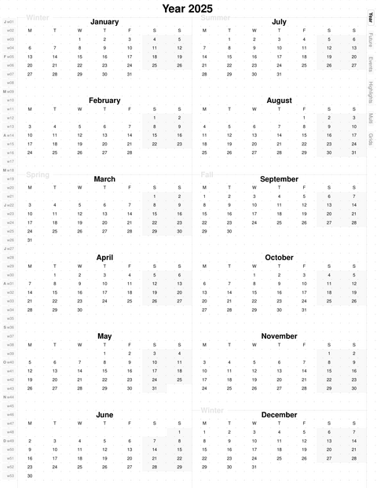
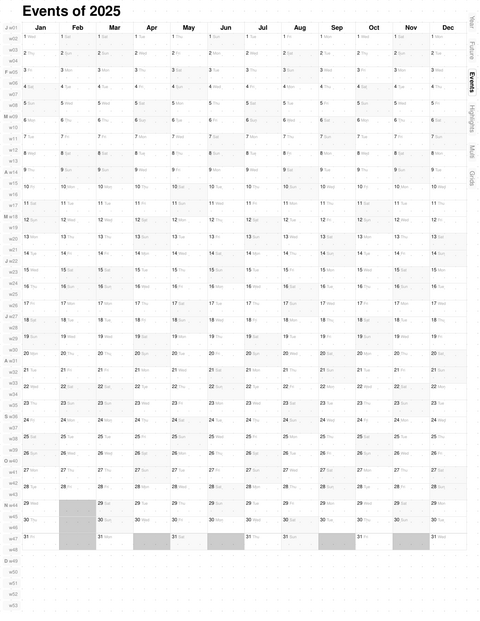
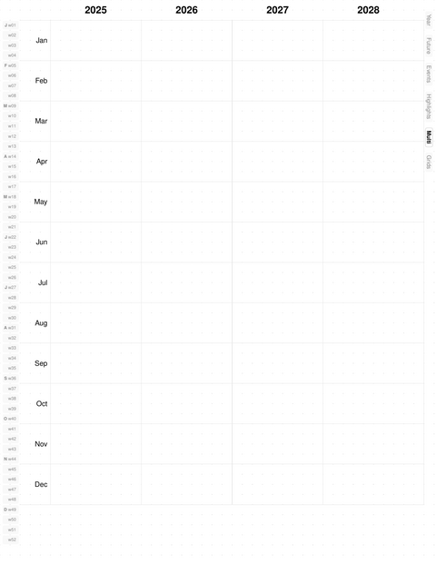
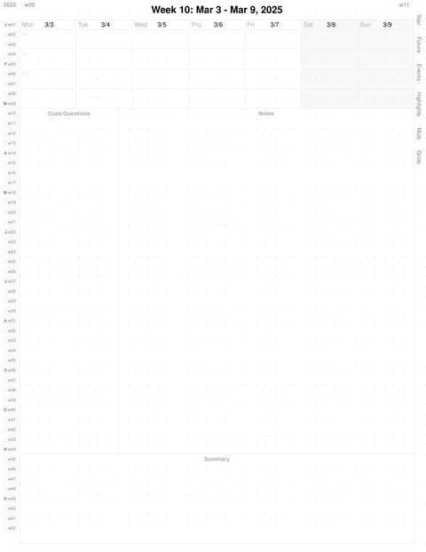
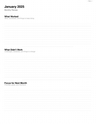
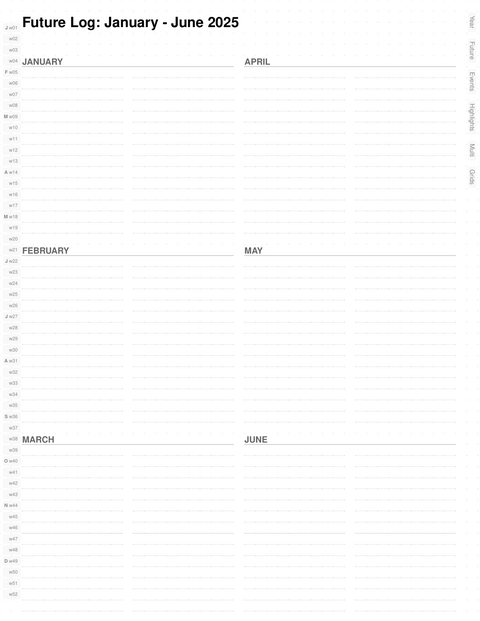
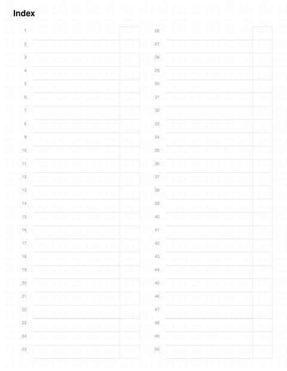
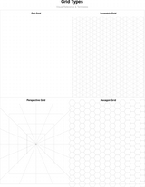
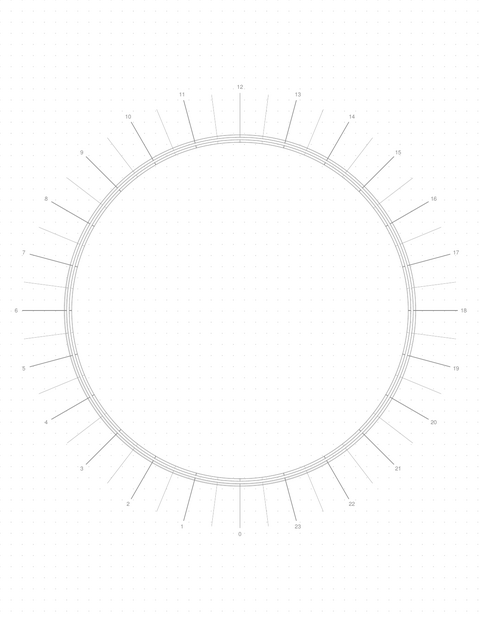
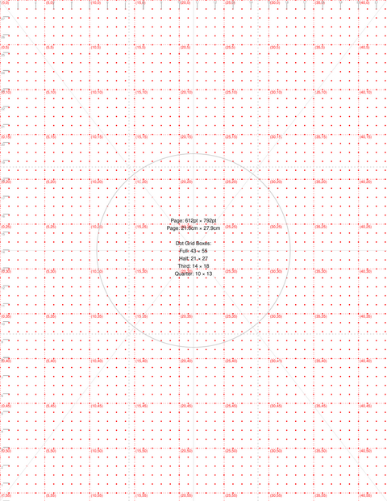

# BujoPdf

Una gema de Ruby para generar PDFs de bullet journals programables, optimizados para aplicaciones de notas digitales como Noteshelf y GoodNotes.

## Descargar PDFs de ejemplo

Planificadores pregenerados con los festivos federales de EE. UU.:

| Tema | 2025 | 2026 |
|-------|------|------|
| **Claro** | [planner_2025_light.pdf](examples/planner_2025_light.pdf) | [planner_2026_light.pdf](examples/planner_2026_light.pdf) |
| **Tierra** | [planner_2025_earth.pdf](examples/planner_2025_earth.pdf) | [planner_2026_earth.pdf](examples/planner_2026_earth.pdf) |
| **Oscuro** | [planner_2025_dark.pdf](examples/planner_2025_dark.pdf) | [planner_2026_dark.pdf](examples/planner_2026_dark.pdf) |

O genera los tuyos con calendarios personalizados usando `bin/generate-examples`.

## Características

- **Temas de color** - Temas Claro, Tierra y Oscuro para diferentes preferencias
- **Calendario estacional** - Vista anual organizada por estaciones con mini calendarios mensuales
- **Páginas de visión anual** - Cuadrículas de eventos y destacados (12 meses × 31 días)
- **Páginas semanales** - Secciones diarias con diseño de notas Cornell para un registro estructurado
- **Plantillas de cuadrícula** - 8 tipos de cuadrícula a página completa: puntos, gráfico, líneas, isométrica, perspectiva, hexágono
- **Páginas de rueda** - Plantillas de rueda diaria y anual para planificación circular
- **Navegación en PDF** - Hipervínculos internos con ciclo de pestañas mediante toques múltiples a través de las páginas de cuadrícula
- **Integración de calendarios** - Importar eventos desde URLs de iCal (Google, Apple, Outlook)
- **Fondos de cuadrícula de puntos** - Espaciado de puntos de 5 mm en toda la aplicación para guiar la escritura a mano
- **Diseño basado en cuadrícula** - Sistema de cuadrícula precisa de 43×55 para una alineación consistente

## Galería de páginas

| | | | |
|:--:|:--:|:--:|:--:|
| Calendario estacional | Visión anual | Resumen multianual | Página semanal |
| [](assets/pages/seasonal.png) | [](assets/pages/year_events.png) | [](assets/pages/multi_year.png) | [](assets/pages/weekly.png) |
| Planificación trimestral | Revisión mensual | Registro futuro | Índice |
| [](assets/pages/quarterly.png) | [](assets/pages/monthly_review.png) | [](assets/pages/future_log.png) | [](assets/pages/index.png) |
| Exposición de cuadrículas | Rueda diaria | Rueda anual | Referencia |
| [](assets/pages/grid_showcase.png) | [](assets/pages/daily_wheel.png) | [](assets/pages/year_wheel.png) | [](assets/pages/reference.png) |

## Instalación

Agrega esta línea al Gemfile de tu aplicación:

```ruby
gem 'bujo-pdf'
```

Y luego ejecuta:

```bash
bundle install
```

O instálalo directamente:

```bash
gem install bujo-pdf
```

## Uso

### Línea de comandos

Genera un planificador para el año actual:

```bash
bujo-pdf
```

Genera para un año específico:

```bash
bujo-pdf 2025
```

Genera con un tema específico:

```bash
bujo-pdf 2025 --theme earth    # Opciones: light, earth, dark
```

Lista los temas disponibles:

```bash
bujo-pdf --list-themes
```

Muestra la ayuda:

```bash
bujo-pdf --help
```

### API de Ruby

```ruby
require 'bujo_pdf'

# Generar para el año actual
BujoPdf.generate

# Generar para un año específico
BujoPdf.generate(2025)

# Especificar tema y ruta de salida
BujoPdf.generate(2025, theme: :earth, output_path: 'my_planner.pdf')
```

### Integración de calendarios

BujoPdf puede resaltar automáticamente eventos de calendarios iCal (Google Calendar, Apple Calendar, Outlook, calendarios de festivos, etc.) en las páginas de tu planificador.

#### Inicio rápido

1. Obtén la URL pública iCal de tu calendario:
   - **Google Calendar**: Configuración → Integrar calendario → Dirección secreta en formato iCal
   - **Apple Calendar**: Compartir calendario → Calendario público
   - **Outlook**: Calendario → Compartir → Publicar calendario

2. Crea `config/calendars.yml`:

```yaml
calendars:
  - name: "Festivos federales de EE. UU."
    url: "https://www.officeholidays.com/ics-fed/usa"
    enabled: true
    color: "FFE5E5"  # Fondo rojo claro
    icon: "*"        # Se muestra con el evento

  - name: "Personal"
    url: "https://calendar.google.com/calendar/ical/YOUR_ID/public/basic.ics"
    enabled: true
    color: "E5F0FF"  # Azul claro
    icon: "+"
```

3. Genera tu planificador: ¡los eventos aparecerán automáticamente!

```bash
bujo-pdf 2025
```

#### Cómo funciona

- **Páginas de visión anual**: Los eventos se muestran con colores de fondo e iconos
- **Páginas semanales**: Las etiquetas de los eventos aparecen debajo de los encabezados de los días
- **Sistema de prioridad**: Los resaltados de archivos planos (dates.yml) tienen precedencia sobre los eventos del calendario
- **Caché**: Los eventos se almacenan en caché durante 24 horas para acelerar la regeneración
- **Múltiples calendarios**: Combina calendarios de trabajo, personales y de festivos

#### Opciones de configuración

Consulta `config/calendars.yml.example` para ver todas las opciones de configuración, incluyendo:
- TTL y directorio de caché
- Configuración de tiempo de espera de red y reintentos
- Filtrado de eventos (patrones de exclusión, eventos máximos por día)
- Opción para omitir eventos de todo el día

#### Calendarios de festivos públicos

URLs gratuitas de calendarios de festivos disponibles en:
- [OfficeHolidays.com](https://www.officeholidays.com/countries) - Festivos federales para EE. UU., Reino Unido, Canadá y más de 100 países
- Festivos federales de EE. UU.: `https://www.officeholidays.com/ics-fed/usa` (11 festivos federales por año)

### Salida

El PDF generado incluye:

1. **Calendario estacional** - Página de resumen con las cuatro estaciones
2. **Páginas de índice** (2) - Líneas numeradas para construir manualmente el índice
3. **Registro futuro** (2) - Vistas de 6 meses para capturar eventos a largo plazo
4. **Eventos del año** - Cuadrícula de 12×31 para seguir eventos durante todo el año
5. **Destacados del año** - Cuadrícula de 12×31 para anotar los momentos destacados del día
6. **Resumen multianual** - Vista de calendario de 4 años
7. **Planificación trimestral** (4) - Páginas de establecimiento de metas de 12 semanas intercaladas con las semanas
8. **Revisión mensual** (12) - Plantillas de reflexión intercaladas con las semanas
9. **Páginas semanales** (52-53) - Una página por semana con:
   - Sección diaria (7 columnas de lun a dom)
   - Sección de notas Cornell (Pistas, Notas, Resumen)
   - Enlaces de navegación a la semana anterior/siguiente
10. **Páginas de cuadrícula** (8) - Plantillas a página completa:
    - Exposición de cuadrículas (todos los tipos en cuadrantes)
    - Resumen de cuadrículas, Puntos, Gráfico, Líneas, Isométrica, Perspectiva, Hexágono
11. **Ejemplo de seguimiento** - Inspiración para seguimiento de hábitos y estados de ánimo
12. **Página de referencia** - Guía de calibración y medición de cuadrículas
13. **Páginas de rueda** - Plantillas de rueda diaria y anual
14. **Páginas de colección** - Configuradas por el usuario a través de `config/collections.yml`

Total de páginas: ~88+ (varía según el año y las colecciones)

## Desarrollo

Después de clonar el repositorio:

```bash
bundle install
rake test              # Ejecutar pruebas
rake generate[2025]    # Generar PDF de prueba
```

Para instalar esta gema en tu máquina local:

```bash
gem build bujo-pdf.gemspec
gem install bujo-pdf-0.2.0.gem
```

Para probar la instalación local:

```bash
rake test_install
```

## Arquitectura

La gema utiliza una arquitectura basada en componentes con:

- **Sistema de cuadrícula** - Convierte coordenadas de cuadrícula a puntos de PDF
- **Sistema de diseño** - Diseños declarativos con gestión automática del área de contenido
- **Componentes** - Elementos de interfaz reutilizables (barras laterales, encabezados, secciones)
- **Páginas** - Clases de página que componen los componentes
- **Utilidades** - Cálculos de fechas, cuadrículas de puntos, auxiliares de estilo

Consulta **[ARCHITECTURE.md](ARCHITECTURE.md)** para la documentación técnica detallada.

## Pruebas

El proyecto incluye un conjunto completo de pruebas que cubren pruebas unitarias y de integración.

### Ejecutar pruebas

```bash
rake test              # Ejecutar todas las pruebas (unitarias + integración)
rake test_unit         # Solo pruebas unitarias (rápido)
rake test_integration  # Pruebas de integración (generación completa de PDF)
```

### Cobertura de pruebas

La cobertura de pruebas se rastrea con SimpleCov. Después de ejecutar las pruebas:

```bash
open coverage/index.html
```

### Áreas de prueba

**Pruebas unitarias**
- GridSystem: Conversión de coordenadas, cálculos de dimensiones, auxiliares
- DateCalculator: Numeración de semanas, límites de año, estaciones
- Components: Fieldset, RuledLines, MiniMonth, WeekGrid, barras laterales
- DSL: Builder, Context, Registry, PageFactory, RenderContext
- Pages: Clases de página, integración de diseño, navegación

**Pruebas de integración**
- Generación y validación completa de PDF
- Soporte multianual y manejo de años bisiestos
- Benchmarks de rendimiento

### Infraestructura de pruebas

- **Framework**: Minitest con minitest-reporters
- **Cobertura**: SimpleCov con informes en HTML
- **Auxiliar de pruebas**: Aserciones personalizadas (assert_grid_position, assert_valid_link_bounds, assert_rect_equals)
- **Objetos simulados (Mocks)**: Clase MockPDF para probar sin generación de PDF
- **Estructura**: Organizada en los directorios test/unit/ y test/integration/

## Contribuciones

Los informes de errores y las solicitudes de extracción (pull requests) son bienvenidos en GitHub en https://github.com/andynu/bujo-pdf.

Este proyecto tiene como ser un espacio seguro y acogedor para la colaboración. Se espera que los colaboradores se adhieran al código de conducta.

## Licencia

La gema está disponible como código abierto bajo los términos de la [Licencia MIT](LICENSE).

## Código de Conducta

Se espera que todas las personas que interactúen en las bases de código, sistemas de seguimiento de incidencias, salas de chat y listas de correo del proyecto BujoPdf sigan estándares profesionales de conducta y respeto mutuo.
