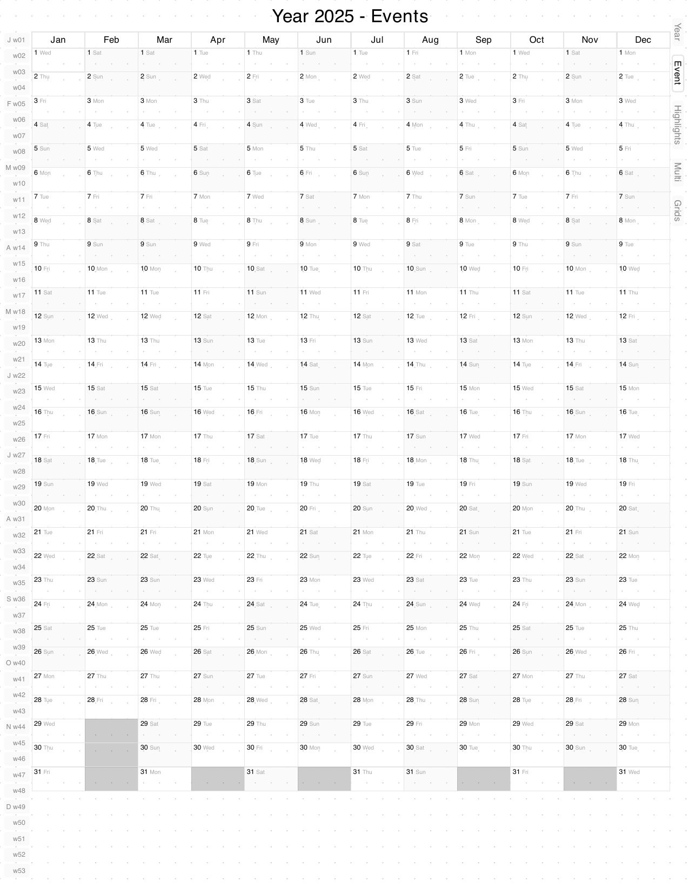
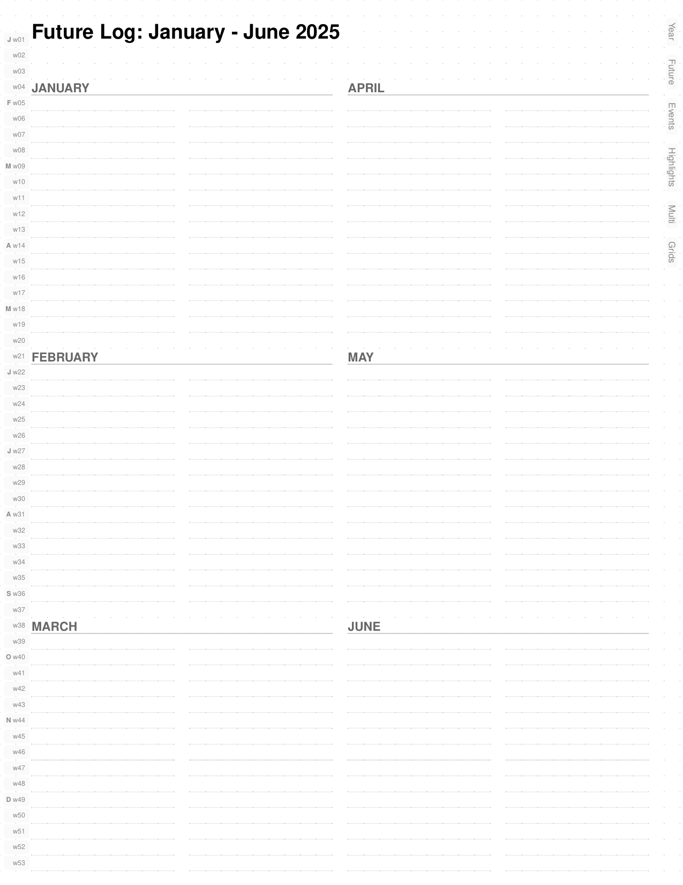
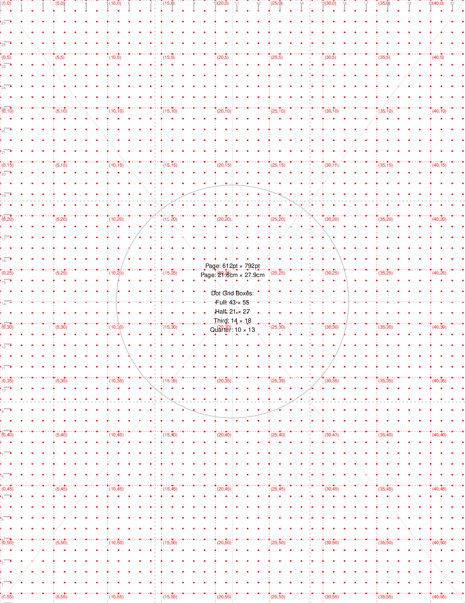

# BujoPdf

A Ruby gem for generating programmable bullet journal PDFs optimized for digital note-taking apps like Noteshelf and GoodNotes.

## Features

- **Seasonal Calendar** - Year-at-a-glance view organized by seasons with mini month calendars
- **Year-at-a-Glance Pages** - Events and Highlights grids (12 months × 31 days)
- **Weekly Pages** - Daily sections with Cornell notes layout for structured note-taking
- **PDF Navigation** - Internal hyperlinks between pages with clickable week numbers and tabs
- **Dot Grid Backgrounds** - 5mm dot spacing throughout for handwriting guidance
- **Grid-Based Layout** - Precise 43×55 grid system for consistent alignment
- **Component Architecture** - Modular, maintainable code structure

## Sample Pages

### Seasonal Calendar
The opening page provides a year-at-a-glance view organized by seasons, with mini month calendars for each month.


### Year-at-a-Glance: Events
A 12×31 grid for tracking events throughout the year. Each day is clickable and links to the corresponding weekly page. (A similar Highlights page is also included.)



### Multi-Year Overview
A comprehensive view spanning multiple years with monthly indicators for long-term planning and navigation.



### Weekly Pages
One page per week with daily sections (Mon-Sun) and Cornell notes layout (Cues, Notes, Summary). Includes navigation to previous/next weeks.


### Reference & Templates

The planner includes a grid calibration/reference page and a blank dot grid template for additional notes.

<details>
<summary>View reference page and blank template</summary>




</details>

## Installation

Add this line to your application's Gemfile:

```ruby
gem 'bujo-pdf'
```

And then execute:

```bash
bundle install
```

Or install directly:

```bash
gem install bujo-pdf
```

## Usage

### Command Line

Generate a planner for the current year:

```bash
bujo-pdf
```

Generate for a specific year:

```bash
bujo-pdf 2025
```

Show version:

```bash
bujo-pdf --version
```

Show help:

```bash
bujo-pdf --help
```

### Ruby API

```ruby
require 'bujo_pdf'

# Generate for current year
BujoPdf.generate

# Generate for specific year
BujoPdf.generate(2025)

# Specify custom output path
BujoPdf.generate(2025, output_path: 'my_planner.pdf')
```

### Calendar Integration

BujoPdf can automatically highlight events from iCal calendars (Google Calendar, Apple Calendar, Outlook, holiday calendars, etc.) on your planner pages.

#### Quick Start

1. Get your calendar's public iCal URL:
   - **Google Calendar**: Settings → Integrate calendar → Secret address in iCal format
   - **Apple Calendar**: Share calendar → Public calendar
   - **Outlook**: Calendar → Share → Publish calendar

2. Create `config/calendars.yml`:

```yaml
calendars:
  - name: "US Holidays"
    url: "https://www.thunderbird.net/media/caldata/autogen/USHolidays.ics"
    enabled: true
    color: "FFE5E5"  # Light red background
    icon: "*"        # Displayed with event

  - name: "Personal"
    url: "https://calendar.google.com/calendar/ical/YOUR_ID/public/basic.ics"
    enabled: true
    color: "E5F0FF"  # Light blue
    icon: "+"
```

3. Generate your planner - events automatically appear!

```bash
bujo-pdf 2025
```

#### How It Works

- **Year-at-a-glance pages**: Events shown with background colors and icons
- **Weekly pages**: Event labels appear below day headers
- **Priority system**: Flat-file highlights (dates.yml) take precedence over calendar events
- **Caching**: Events cached for 24 hours to speed up regeneration
- **Multiple calendars**: Combine work, personal, and holiday calendars

#### Configuration Options

See `config/calendars.yml.example` for full configuration options including:
- Cache TTL and directory
- Network timeout and retry settings
- Event filtering (exclude patterns, max events per day)
- Skip all-day events option

#### Public Holiday Calendars

Free holiday calendar URLs available from:
- [Thunderbird Holidays](https://www.thunderbird.net/en-US/calendar/holidays/)
- Includes US, UK, Canada, and many other countries

### Output

The generated PDF includes:

1. **Seasonal Calendar** - Overview page with all four seasons
2. **Year Events** - 12×31 grid for tracking events throughout the year
3. **Year Highlights** - 12×31 grid for noting daily highlights
4. **Weekly Pages** (52-53 pages) - One page per week with:
   - Daily section (7 columns for Mon-Sun)
   - Cornell notes section (Cues, Notes, Summary)
   - Navigation links to previous/next week
5. **Reference Page** - Grid calibration and measurement guide
6. **Blank Dot Grid** - Template page for additional notes

Total pages: 57-58 (varies by year)

## Development

After checking out the repo:

```bash
bundle install
rake test              # Run tests
rake generate[2025]    # Generate test PDF
```

To install this gem onto your local machine:

```bash
gem build bujo-pdf.gemspec
gem install bujo-pdf-0.1.0.gem
```

To test local installation:

```bash
rake test_install
```

## Architecture

The gem uses a component-based architecture with:

- **Grid System** - Converts grid coordinates to PDF points
- **Layout System** - Declarative layouts with automatic content area management
- **Components** - Reusable UI elements (sidebars, headers, sections)
- **Pages** - Page classes that compose components
- **Utilities** - Date calculations, dot grids, styling helpers

See **[ARCHITECTURE.md](ARCHITECTURE.md)** for detailed technical documentation.

## Testing

The project includes a comprehensive test suite with 98 tests covering unit and integration testing.

### Running Tests

Run all tests (unit + integration):

```bash
rake test
```

Run only unit tests (fast, <1 second):

```bash
rake test_unit
```

Run only integration tests (slower, ~30 seconds):

```bash
rake test_integration
```

### Test Coverage

**Unit Tests** (88 tests, 2408 assertions)
- **GridSystem**: Coordinate conversion (grid_x, grid_y), dimension calculations (grid_width, grid_height), helpers (grid_rect, grid_inset, grid_bottom), text/link positioning
- **DotGrid**: Dot drawing at intersections, radius and color customization, position calculations
- **DateCalculator**: Week numbering system, year_start_monday calculations for all weekdays, total_weeks across multiple years, week_start/week_end boundaries, week_number_for_date including leap days, season calculations and month abbreviations, edge cases (leap years, year boundaries, week gaps)
- **RenderContext**: Initialization, current_page? and weekly_page? methods, destination string conversion, bracket accessor, immutability and serialization

**Integration Tests** (10 tests, 20 assertions)
- **PlannerGeneration**: Successful generation without errors, PDF file size validation (100KB-10MB), generation performance (<10 seconds), multi-year generation (2024-2026), leap year handling, custom output paths, independent multi-year generation, generation idempotency, nested directory creation

### Test Results

```
98 tests, 2428 assertions
0 failures, 0 errors, 1 skip
Completed in ~38 seconds

Code Coverage: 84.13% (1267 / 1506 lines)
```

### Code Coverage

Test coverage is tracked using SimpleCov. After running tests, open the coverage report:

```bash
open coverage/index.html
```

Coverage is organized by module:
- **Utilities**: Core helper classes (GridSystem, DateCalculator, etc.)
- **Components**: Reusable UI components (sidebars, fieldsets, etc.)
- **Pages**: Page generation classes
- **Layouts**: Layout management
- **Core**: Top-level module and generator

**Coverage Targets**:
- Overall: 80% minimum
- Per-file: 15% minimum (presentation layer files harder to test)

### Test Infrastructure

- **Framework**: Minitest with minitest-reporters for better output
- **Coverage**: SimpleCov with HTML reports
- **Test Helper**: Custom assertions (assert_grid_position, assert_valid_link_bounds, assert_rect_equals)
- **Mock Objects**: MockPDF class for testing without PDF generation
- **Structure**: Organized into test/unit/ and test/integration/ directories

## Contributing

Bug reports and pull requests are welcome on GitHub at https://github.com/andynu/bujo-pdf.

This project is intended to be a safe, welcoming space for collaboration. Contributors are expected to adhere to the code of conduct.

## License

The gem is available as open source under the terms of the [MIT License](LICENSE).

## Code of Conduct

Everyone interacting in the BujoPdf project's codebases, issue trackers, chat rooms and mailing lists is expected to follow professional standards of conduct and mutual respect.
