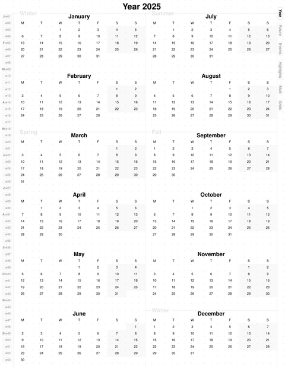
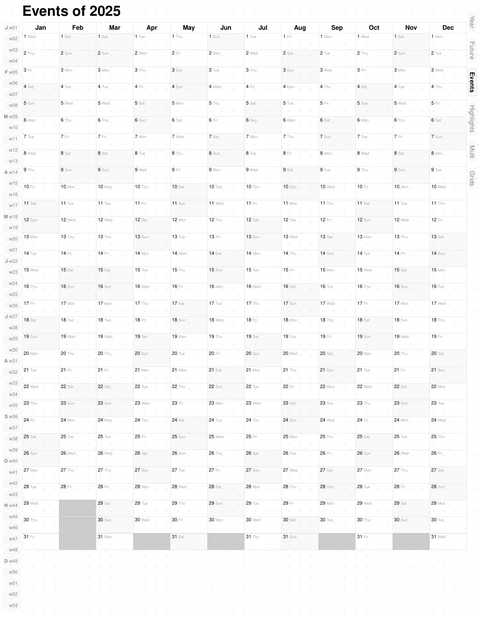
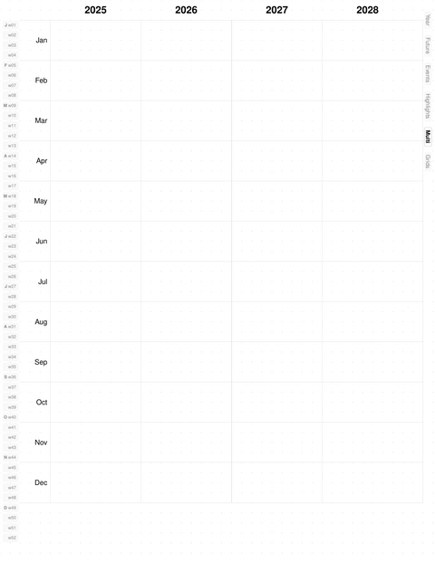
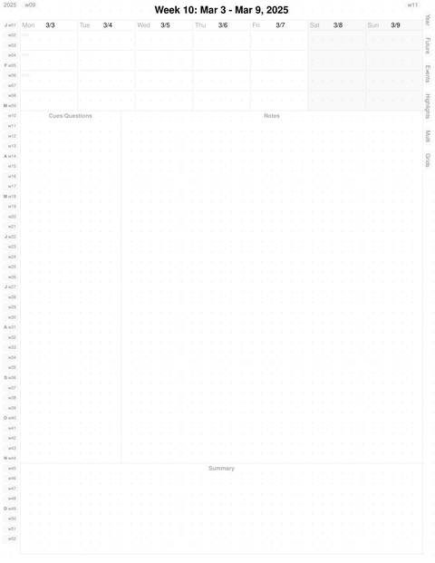
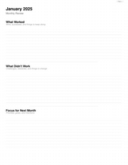
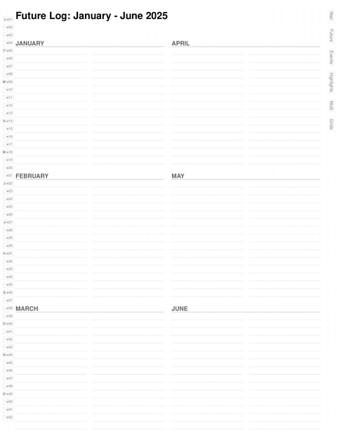
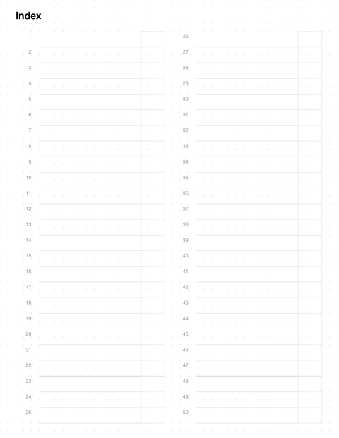
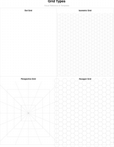
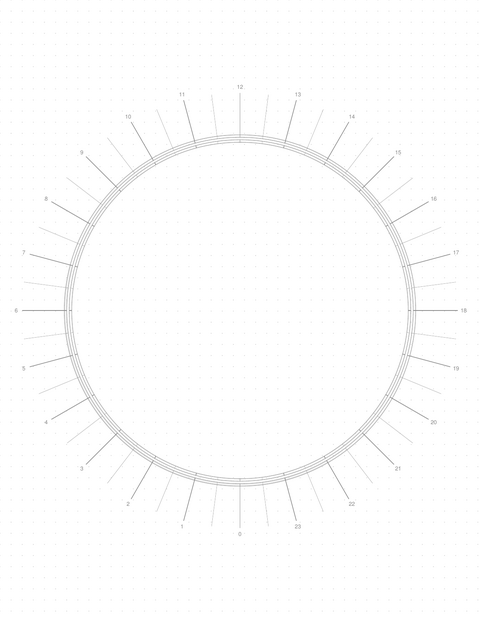
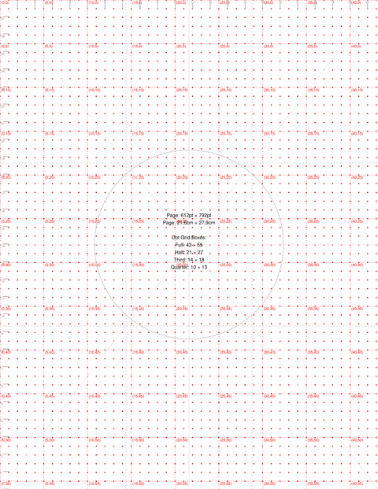

# BujoPdf

A Ruby gem for generating programmable bullet journal PDFs optimized for digital note-taking apps like Noteshelf and GoodNotes.

## Download Example PDFs

Pre-generated planners with US Federal Holidays:

| Theme | 2025 | 2026 |
|-------|------|------|
| **Light** | [planner_2025_light.pdf](examples/planner_2025_light.pdf) | [planner_2026_light.pdf](examples/planner_2026_light.pdf) |
| **Earth** | [planner_2025_earth.pdf](examples/planner_2025_earth.pdf) | [planner_2026_earth.pdf](examples/planner_2026_earth.pdf) |
| **Dark** | [planner_2025_dark.pdf](examples/planner_2025_dark.pdf) | [planner_2026_dark.pdf](examples/planner_2026_dark.pdf) |

Or generate your own with custom calendars using `bin/generate-examples`.

## Features

- **Color Themes** - Light, Earth, and Dark themes for different preferences
- **Seasonal Calendar** - Year-at-a-glance view organized by seasons with mini month calendars
- **Year-at-a-Glance Pages** - Events and Highlights grids (12 months × 31 days)
- **Weekly Pages** - Daily sections with Cornell notes layout for structured note-taking
- **Grid Templates** - 8 full-page grid types: dot, graph, lined, isometric, perspective, hexagon
- **Wheel Pages** - Daily and Year wheel templates for circular planning
- **PDF Navigation** - Internal hyperlinks with multi-tap tab cycling through grid pages
- **Calendar Integration** - Import events from iCal URLs (Google, Apple, Outlook)
- **Dot Grid Backgrounds** - 5mm dot spacing throughout for handwriting guidance
- **Grid-Based Layout** - Precise 43×55 grid system for consistent alignment

## Page Gallery

| | | | |
|:--:|:--:|:--:|:--:|
| Seasonal Calendar | Year at a Glance | Multi-Year Overview | Weekly Page |
| [](assets/pages/seasonal.png) | [](assets/pages/year_events.png) | [](assets/pages/multi_year.png) | [](assets/pages/weekly.png) |
| Quarterly Planning | Monthly Review | Future Log | Index |
| [](assets/pages/quarterly.png) | [](assets/pages/monthly_review.png) | [](assets/pages/future_log.png) | [](assets/pages/index.png) |
| Grid Showcase | Daily Wheel | Year Wheel | Reference |
| [](assets/pages/grid_showcase.png) | [](assets/pages/daily_wheel.png) | [](assets/pages/year_wheel.png) | [](assets/pages/reference.png) |

## Installation

Add this line to your application's Gemfile:

```ruby
gem 'bujo-pdf'
```

And then execute:

```bash
bundle install
```

Or install directly:

```bash
gem install bujo-pdf
```

## Usage

### Command Line

Generate a planner for the current year:

```bash
bujo-pdf
```

Generate for a specific year:

```bash
bujo-pdf 2025
```

Generate with a specific theme:

```bash
bujo-pdf 2025 --theme earth    # Options: light, earth, dark
```

List available themes:

```bash
bujo-pdf --list-themes
```

Show help:

```bash
bujo-pdf --help
```

### Ruby API

```ruby
require 'bujo_pdf'

# Generate for current year
BujoPdf.generate

# Generate for specific year
BujoPdf.generate(2025)

# Specify theme and output path
BujoPdf.generate(2025, theme: :earth, output_path: 'my_planner.pdf')
```

### Calendar Integration

BujoPdf can automatically highlight events from iCal calendars (Google Calendar, Apple Calendar, Outlook, holiday calendars, etc.) on your planner pages.

#### Quick Start

1. Get your calendar's public iCal URL:
   - **Google Calendar**: Settings → Integrate calendar → Secret address in iCal format
   - **Apple Calendar**: Share calendar → Public calendar
   - **Outlook**: Calendar → Share → Publish calendar

2. Create `config/calendars.yml`:

```yaml
calendars:
  - name: "US Federal Holidays"
    url: "https://www.officeholidays.com/ics-fed/usa"
    enabled: true
    color: "FFE5E5"  # Light red background
    icon: "*"        # Displayed with event

  - name: "Personal"
    url: "https://calendar.google.com/calendar/ical/YOUR_ID/public/basic.ics"
    enabled: true
    color: "E5F0FF"  # Light blue
    icon: "+"
```

3. Generate your planner - events automatically appear!

```bash
bujo-pdf 2025
```

#### How It Works

- **Year-at-a-glance pages**: Events shown with background colors and icons
- **Weekly pages**: Event labels appear below day headers
- **Priority system**: Flat-file highlights (dates.yml) take precedence over calendar events
- **Caching**: Events cached for 24 hours to speed up regeneration
- **Multiple calendars**: Combine work, personal, and holiday calendars

#### Configuration Options

See `config/calendars.yml.example` for full configuration options including:
- Cache TTL and directory
- Network timeout and retry settings
- Event filtering (exclude patterns, max events per day)
- Skip all-day events option

#### Public Holiday Calendars

Free holiday calendar URLs available from:
- [OfficeHolidays.com](https://www.officeholidays.com/countries) - Federal holidays for US, UK, Canada, and 100+ countries
- US Federal Holidays: `https://www.officeholidays.com/ics-fed/usa` (11 federal holidays per year)

### Output

The generated PDF includes:

1. **Seasonal Calendar** - Overview page with all four seasons
2. **Index Pages** (2) - Numbered lines for hand-built table of contents
3. **Future Log** (2) - 6-month spreads for long-term event capture
4. **Year Events** - 12×31 grid for tracking events throughout the year
5. **Year Highlights** - 12×31 grid for noting daily highlights
6. **Multi-Year Overview** - 4-year calendar spread
7. **Quarterly Planning** (4) - 12-week goal-setting pages interleaved with weeks
8. **Monthly Reviews** (12) - Reflection templates interleaved with weeks
9. **Weekly Pages** (52-53) - One page per week with:
   - Daily section (7 columns for Mon-Sun)
   - Cornell notes section (Cues, Notes, Summary)
   - Navigation links to previous/next week
10. **Grid Pages** (8) - Full-page templates:
    - Grid Showcase (all types in quadrants)
    - Grids Overview, Dot, Graph, Lined, Isometric, Perspective, Hexagon
11. **Tracker Example** - Habit and mood tracking inspiration
12. **Reference Page** - Grid calibration and measurement guide
13. **Wheel Pages** - Daily Wheel and Year Wheel templates
14. **Collection Pages** - User-configured via `config/collections.yml`

Total pages: ~88+ (varies by year and collections)

## Development

After checking out the repo:

```bash
bundle install
rake test              # Run tests
rake generate[2025]    # Generate test PDF
```

To install this gem onto your local machine:

```bash
gem build bujo-pdf.gemspec
gem install bujo-pdf-0.2.0.gem
```

To test local installation:

```bash
rake test_install
```

## Architecture

The gem uses a component-based architecture with:

- **Grid System** - Converts grid coordinates to PDF points
- **Layout System** - Declarative layouts with automatic content area management
- **Components** - Reusable UI elements (sidebars, headers, sections)
- **Pages** - Page classes that compose components
- **Utilities** - Date calculations, dot grids, styling helpers

See **[ARCHITECTURE.md](ARCHITECTURE.md)** for detailed technical documentation.

## Testing

The project includes a comprehensive test suite with 342 tests covering unit and integration testing.

### Running Tests

Run all tests (unit + integration):

```bash
rake test
```

Run only unit tests (fast, <1 second):

```bash
rake test_unit
```

Run only integration tests (slower, ~30 seconds):

```bash
rake test_integration
```

### Test Coverage

**Unit Tests** (318 tests, 3091 assertions)
- **GridSystem**: Coordinate conversion, dimension calculations, helpers (grid_rect, grid_inset, grid_bottom), text/link positioning
- **DateCalculator**: Week numbering, year boundaries, leap years, season calculations
- **Components**: Fieldset, RuledLines, MiniMonth, WeekGrid, sidebars
- **DSL**: Builder, Context, Registry, PageFactory, RenderContext
- **Pages**: Page classes, layout integration, navigation

**Integration Tests** (24 tests, 39 assertions)
- **PlannerGeneration**: Full PDF generation, file validation, multi-year support, leap year handling, performance benchmarks

### Test Results

```
342 tests, 3130 assertions
0 failures, 0 errors, 1 skip
Completed in ~76 seconds

Code Coverage: 86.53% (4650 / 5374 lines)
```

### Code Coverage

Test coverage is tracked using SimpleCov. After running tests, open the coverage report:

```bash
open coverage/index.html
```

Coverage is organized by module:
- **Utilities**: Core helper classes (GridSystem, DateCalculator, etc.)
- **Components**: Reusable UI components (sidebars, fieldsets, etc.)
- **Pages**: Page generation classes
- **Layouts**: Layout management
- **Core**: Top-level module and generator

**Coverage Targets**:
- Overall: 80% minimum
- Per-file: 15% minimum (presentation layer files harder to test)

### Test Infrastructure

- **Framework**: Minitest with minitest-reporters for better output
- **Coverage**: SimpleCov with HTML reports
- **Test Helper**: Custom assertions (assert_grid_position, assert_valid_link_bounds, assert_rect_equals)
- **Mock Objects**: MockPDF class for testing without PDF generation
- **Structure**: Organized into test/unit/ and test/integration/ directories

## Contributing

Bug reports and pull requests are welcome on GitHub at https://github.com/andynu/bujo-pdf.

This project is intended to be a safe, welcoming space for collaboration. Contributors are expected to adhere to the code of conduct.

## License

The gem is available as open source under the terms of the [MIT License](LICENSE).

## Code of Conduct

Everyone interacting in the BujoPdf project's codebases, issue trackers, chat rooms and mailing lists is expected to follow professional standards of conduct and mutual respect.
